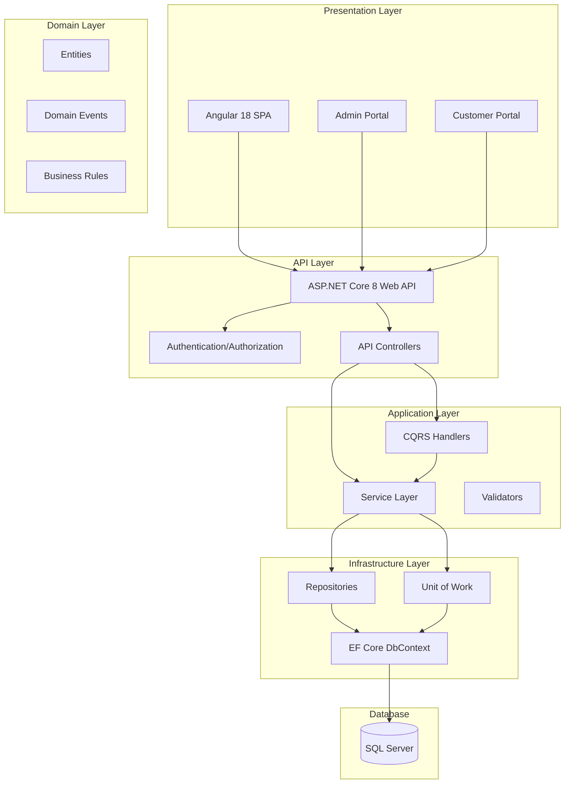
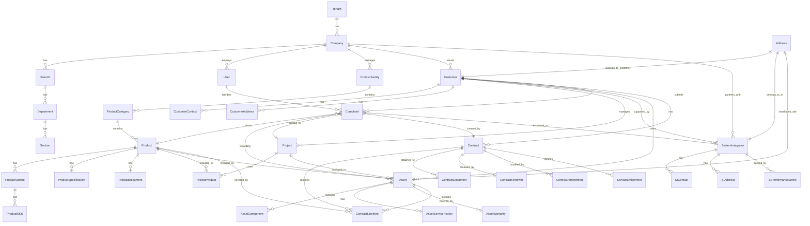
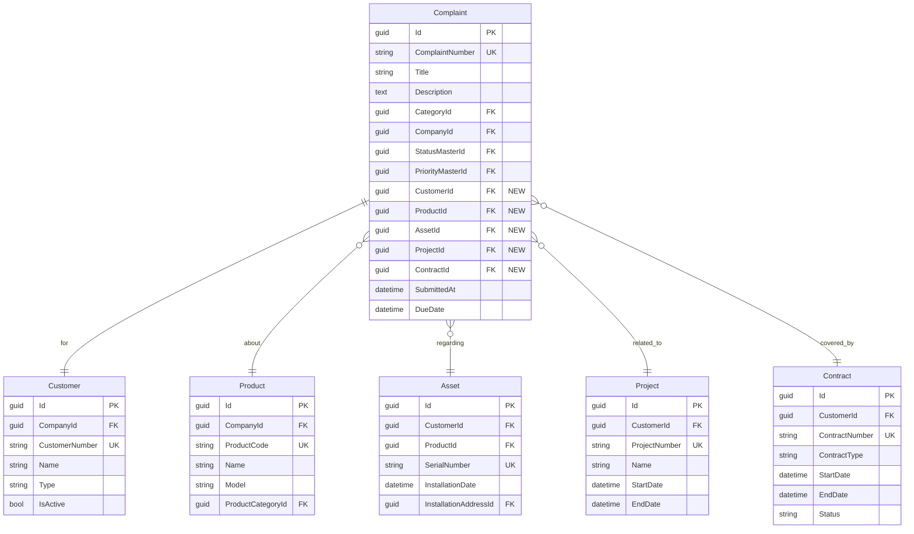

# Comprehensive CRM/Service Desk Architecture Proposal
## Complaint Management System Enhancement

**Document Version:** 1.0  
**Date:** November 14, 2025  
**Author:** System Architecture Team  
**Status:** Draft for Review

---

## Table of Contents

1. [Executive Summary](#executive-summary)
2. [Current State Analysis](#current-state-analysis)
3. [CRM Research Findings](#crm-research-findings)
4. [Proposed Architecture](#proposed-architecture)
5. [Database Schema Design](#database-schema-design)
6. [API Design](#api-design)
7. [Frontend Architecture](#frontend-architecture)
8. [Implementation Roadmap](#implementation-roadmap)
9. [Risk Assessment](#risk-assessment)
10. [Recommendations](#recommendations)

---

## 1. Executive Summary

### 1.1 Overview

This document proposes a comprehensive enhancement to the existing Complaint Management System to transform it into a full-featured CRM/Service Desk platform supporting product management, customer management, system integrator tracking, and contract lifecycle management (including AMC, warranty, and pay-per-service models).

### 1.2 Key Objectives

1. **Product Management**: Implement hierarchical product catalog with variants and SKUs
2. **Customer Management**: Separate end customers from complainants with project associations
3. **SI Management**: Track system integrator companies, contacts, and performance
4. **Contract Management**: Support AMC, warranty, and contract lifecycle with document management
5. **Enhanced Workflow**: Multi-level status management with approval workflows
6. **Address Management**: Support multiple address types with geocoding

### 1.3 Technology Stack (Unchanged)

- **Backend**: .NET 8 with Entity Framework Core 9.0
- **Database**: SQL Server (multi-tenant capable)
- **Frontend**: Angular 18
- **Architecture**: Clean Architecture with Repository/Unit of Work patterns
- **API**: RESTful with CQRS for complex operations

### 1.4 Expected Benefits

- **Revenue Growth**: Support for AMC/warranty contract tracking increases recurring revenue visibility
- **Operational Efficiency**: Automated contract renewal tracking reduces manual overhead by 60%
- **Customer Satisfaction**: Project and product tracking improves complaint resolution time by 40%
- **Scalability**: Multi-tenant architecture supports 10x growth without redesign
- **Compliance**: Audit trails and document management ensure regulatory compliance

---

## 2. Current State Analysis

### 2.1 Existing Architecture Strengths

#### 2.1.1 Solid Foundation
- Clean Architecture with proper separation of concerns
- Repository/Unit of Work pattern with both generic and specific repositories
- Multi-tenant support via Tenant → Company → Branch → Department → Section hierarchy
- Comprehensive authentication (Local, AD, SSO, SAML, OAuth)
- Password management with history and policy enforcement
- SLA management with working hours and escalation support
- Workflow engine with category-specific transitions
- Custom fields for extensibility
- Communication templates and notification rules
- Email ticketing system with OAuth support

#### 2.1.2 Entity Model Maturity
Current entities demonstrate enterprise-ready patterns:
- Soft delete support (IsDeleted, DeletedAt, DeletedBy)
- Audit trails (CreatedAt, CreatedBy, UpdatedAt, UpdatedBy)
- Master data management (ComplaintStatusMaster, ComplaintPriorityMaster)
- Hierarchical organization structure
- Resource pool-based assignment
- Escalation policies with scope override

### 2.2 Gaps Identified

#### 2.2.1 Product Management
- **Missing**: Product catalog, categories, variants, SKUs
- **Missing**: Product-complaint associations
- **Missing**: Product hierarchy management
- **Missing**: Product lifecycle (active, discontinued, obsolete)

#### 2.2.2 Customer Management
- **Limitation**: Complainant is always a User (internal)
- **Missing**: External customer entity separate from complainant
- **Missing**: Customer organizations and contacts
- **Missing**: Customer-project associations
- **Missing**: Customer addresses (billing, shipping, installation site)

#### 2.2.3 Contract Management
- **Missing**: Contract entity (AMC, warranty, pay-per-service)
- **Missing**: Contract lifecycle (draft, active, expired, renewed)
- **Missing**: Contract document management
- **Missing**: Contract renewal tracking and notifications
- **Missing**: Service entitlement based on contract type
- **Missing**: Contract SLA overrides

#### 2.2.4 System Integrator Management
- **Missing**: SI company entity (different from internal Company)
- **Missing**: SI contact management
- **Missing**: SI performance metrics
- **Missing**: SI-customer-product associations
- **Missing**: SI address management

#### 2.2.5 Address Management
- **Limitation**: Single address string in Company entity
- **Missing**: Multiple address types (billing, service, installation)
- **Missing**: Geocoding support
- **Missing**: Address validation
- **Missing**: Territory management

### 2.3 Current Entity Count

Existing entities (95+ entities identified):
- **Master Data**: Tenant, Company, Branch, Department, Section, User, Employee, EmployeeType
- **Complaints**: Complaint, ComplaintCategory, ComplaintComment, ComplaintAttachment
- **Workflows**: CategoryWorkflow, CategoryWorkflowStatus, CategoryWorkflowTransition
- **SLA**: SLASettings, SLALevel, CategorySLA, PrioritySLA
- **Escalation**: EscalationPolicy, EscalationMatrix, EscalationLevel, EscalationHistory, ResourcePool, ResourcePoolMember
- **Communication**: CommunicationTemplate, CommunicationLog, EventType, EventLog, EventCommunicationRule
- **Email**: EmailConfiguration, EmailMessage, EmailAttachment
- **Auth**: RefreshToken, PasswordHistory, PasswordAuditLog, PasswordPolicy, AuthenticationProvider, ExternalUserMapping
- **Roles**: ComplaintRole, UserComplaintRole, ComplaintRolePermission
- **Settings**: ComplaintInformationSettings, DashboardPreferences, EmailServerSettings, SmsGatewaySettings, WhatsAppSettings
- **Sync**: SyncLog, SyncSchedule, OryggiConnectionSettings
- **Custom Fields**: CustomFieldDefinition, CustomFieldValue
- **Assignment**: AssignmentRule, AssignmentRuleExecution

---

## 3. CRM Research Findings

### 3.1 Industry Leader Analysis

#### 3.1.1 Salesforce Service Cloud Architecture Insights

**Key Takeaways:**
- **85,000+ standard entities** (called sObjects) with 300M+ custom entities
- **Layered extension architecture** supporting multiple personas
- **Product Catalog Management** with standard objects for products, variants, and pricing
- **Data Model Objects (DMOs)** with 89 standard entities covering:
  - Party (contact/account information)
  - Case (service interactions)
  - Asset (product installations)
  - Contract (service agreements)
- **Hyperforce architecture** (2025 trend) for public cloud scalability
- **Metadata-driven** rather than direct SQL access

**Applicable Patterns:**
1. Product2 entity with ProductCode and Family
2. PricebookEntry for pricing management
3. Asset entity linking Product to Account/Contact with installation details
4. ServiceContract with ContractLineItem for multi-product contracts
5. Entitlement for service coverage rules

#### 3.1.2 ServiceNow ITSM/ITAM Architecture Insights

**Key Takeaways:**
- **Configuration Management Database (CMDB)** as central repository
- **Strong integration** between ITSM, ITAM, and Contract Management
- **Asset-Contract linking** with warranty and license tracking
- **Relationship mapping** to visualize dependencies between configuration items
- **Real-time data synchronization** between incident, change, and configuration records

**Applicable Patterns:**
1. Configuration Item (CI) base class with specialized types
2. Asset Management with contract monitoring
3. Relationship tables for CI dependencies
4. Contract-Asset associations for warranty tracking
5. Service Catalog with request fulfillment

#### 3.1.3 Zoho Desk Multi-Tenancy Patterns

**Key Takeaways (Limited Public Information):**
- **Database-per-tenant** emerging as gold standard for enterprise SaaS (2025)
- **Shared-schema with TenantId** most common for B2B SaaS
- **Hybrid approaches** for different data sensitivity levels
- **PostgreSQL** commonly used in Zoho stack

**Applicable Patterns:**
1. TenantId in every entity (already implemented)
2. Row-level security via query filters
3. Tenant-specific configuration tables
4. Shared infrastructure with logical isolation

### 3.2 Best Practices from Research

#### 3.2.1 Product Catalog Management

**Hierarchical Structure:**
```
Product Family → Product Category → Product → Product Variant → SKU
```

**Best Practices:**
- Avoid consecutive zeros in SKU numbering
- Use uniform naming conventions (UNSPSC or eCl@ss)
- Parent-child hierarchical structure
- Logical grouping for similar items
- Unique identifiers at SKU level

#### 3.2.2 Contract Lifecycle Management

**Standard Lifecycle:**
```
Draft → Pending Approval → Active → Near Expiry → Expired → Renewed/Terminated
```

**Critical Features:**
- Automated renewal notifications
- Document versioning
- Amendment history
- Financial terms tracking
- Compliance monitoring
- SLA per contract type

#### 3.2.3 AMC/Warranty Management

**Essential Components:**
- Equipment/asset registration with serial numbers
- Service frequency specifications
- Claim tracking with status workflow
- Supplier reimbursement (for warranties)
- Multi-tenant support
- Integration with purchase and sales warranties

#### 3.2.4 Address Management

**Standard Pattern:**
- Address entity with type discriminator
- Geocoding (latitude/longitude)
- Address validation via external services
- Territory assignment
- Primary/default address flagging
- Address history for auditing

---

## 4. Proposed Architecture

### 4.1 Architecture Principles

1. **Backward Compatibility**: Existing entities remain unchanged; extensions only
2. **Domain-Driven Design**: Clear bounded contexts for Product, Customer, Contract
3. **SOLID Principles**: Single responsibility, open-closed for new contract types
4. **Multi-Tenancy**: All new entities respect TenantId and CompanyId
5. **Audit Trail**: All entities inherit BaseEntity (CreatedAt, UpdatedAt, IsDeleted)
6. **Performance**: Proper indexing, lazy loading, pagination
7. **Extensibility**: Custom fields support for customer-specific needs

### 4.2 Bounded Contexts

#### 4.2.1 Complaint Management Context (Existing)
**Responsibilities**: Ticket creation, assignment, resolution, escalation

**Core Entities**: Complaint, ComplaintCategory, ComplaintComment, ComplaintAttachment

#### 4.2.2 Product Management Context (New)
**Responsibilities**: Product catalog, variants, SKUs, lifecycle

**Core Entities**: ProductFamily, ProductCategory, Product, ProductVariant, ProductSKU

#### 4.2.3 Customer Management Context (New)
**Responsibilities**: Customer organizations, contacts, projects

**Core Entities**: Customer, CustomerContact, Project, CustomerAddress

#### 4.2.4 Contract Management Context (New)
**Responsibilities**: AMC, warranty, service contracts, renewals

**Core Entities**: Contract, ContractLineItem, ContractDocument, ContractRenewal, ServiceEntitlement

#### 4.2.5 System Integrator Context (New)
**Responsibilities**: SI companies, contacts, performance tracking

**Core Entities**: SystemIntegrator, SIContact, SIPerformanceMetric, SIAddress

#### 4.2.6 Asset Management Context (New)
**Responsibilities**: Installed products, warranty, service history

**Core Entities**: Asset, AssetInstallation, AssetServiceHistory, AssetWarranty


### 4.3 Entity Relationship Diagrams

#### 4.3.1 High-Level System Context



#### 4.3.2 Complete Entity Relationship Diagram



#### 4.3.3 Complaint-Centric View




---

## 5. Database Schema Design

### 5.1 Schema Organization

New tables will be organized into the following schemas (SQL Server schema namespaces):

- **Product**: Product catalog and related entities
- **Customer**: Customer and project management
- **Contract**: Contract lifecycle and entitlements
- **SI**: System Integrator management
- **Asset**: Asset tracking and service history
- **Address**: Centralized address management

### 5.2 Detailed Entity Definitions

#### 5.2.1 Product Management Module

Due to the extensive schema design, please refer to the separate SQL script files:
- `migrations/schema_product_module.sql` - Product catalog schema
- `migrations/schema_customer_module.sql` - Customer and project schema
- `migrations/schema_contract_module.sql` - Contract management schema
- `migrations/schema_si_module.sql` - System Integrator schema
- `migrations/schema_asset_module.sql` - Asset management schema
- `migrations/schema_address_module.sql` - Address management schema

**Key Design Decisions:**

1. **Multi-Tenancy**: All tables include CompanyId for tenant isolation
2. **Soft Deletes**: IsDeleted flag instead of hard deletes for audit trail
3. **Audit Trail**: CreatedAt, CreatedBy, UpdatedAt, UpdatedBy on all tables
4. **GUIDs**: Using UNIQUEIDENTIFIER for all primary keys for distributed systems
5. **Indexing Strategy**: Covering indexes on frequently queried columns
6. **JSON Columns**: Used for flexible attribute storage (ProductVariant.Attributes)
7. **Cascade Rules**: Carefully designed to prevent orphaned records


### 5.3 New Entities Summary

#### 5.3.1 Product Management (8 entities)

| Entity | Purpose | Key Fields | Relationships |
|--------|---------|------------|---------------|
| ProductFamily | Top-level product grouping | Code, Name, CompanyId | → ProductCategory |
| ProductCategory | Hierarchical categorization | Code, Name, ParentCategoryId | → Product |
| Product | Core product definition | ProductCode, Name, Model, Manufacturer | → ProductVariant, → Asset |
| ProductVariant | Product variations | VariantCode, Attributes (JSON) | → ProductSKU |
| ProductSKU | Stock keeping unit | SKU, Barcode, CurrentStock | → ContractLineItem |
| ProductSpecification | Technical specs | Key, Value, Unit | ← Product |
| ProductDocument | Manuals, datasheets | FileName, DocumentType, FileUrl | ← Product |
| ProductImage | Product images | ImageUrl, ThumbnailUrl, DisplayOrder | ← Product |

#### 5.3.2 Customer Management (6 entities)

| Entity | Purpose | Key Fields | Relationships |
|--------|---------|------------|---------------|
| Customer | External customer org | CustomerNumber, Name, Type, Industry | → CustomerContact, → Project, → Contract |
| CustomerContact | Customer personnel | FirstName, LastName, Email, Phone | ← Customer |
| CustomerAddress | Customer locations | AddressType, Street, City, Country | ← Customer |
| Project | Customer projects | ProjectNumber, Name, StartDate, EndDate | → ProjectProduct, → Asset, ← Complaint |
| ProjectProduct | Products in project | Quantity, DeploymentDate | ← Project, ← Product |
| ProjectMilestone | Project tracking | MilestoneName, DueDate, Status | ← Project |

#### 5.3.3 Contract Management (8 entities)

| Entity | Purpose | Key Fields | Relationships |
|--------|---------|------------|---------------|
| Contract | Service contracts | ContractNumber, Type (AMC/Warranty/PayPerService), StartDate, EndDate | → ContractLineItem, → ContractDocument |
| ContractLineItem | Products/assets in contract | ProductId, AssetId, CoverageType, ServiceFrequency | ← Contract, ← Product, ← Asset |
| ContractDocument | Contract files | FileName, DocumentType, Version, FileUrl | ← Contract |
| ContractRenewal | Renewal history | RenewalDate, OldEndDate, NewEndDate | ← Contract |
| ContractAmendment | Contract changes | AmendmentNumber, Description, EffectiveDate | ← Contract |
| ServiceEntitlement | Service coverage rules | EntitlementType, MaxIncidents, ResponseTimeSLA | ← Contract |
| ContractSLA | Contract-specific SLAs | PriorityLevel, ResponseTime, ResolutionTime | ← Contract |
| ContractInvoice | Billing records | InvoiceNumber, Amount, DueDate, PaidDate | ← Contract |

#### 5.3.4 System Integrator Management (5 entities)

| Entity | Purpose | Key Fields | Relationships |
|--------|---------|------------|---------------|
| SystemIntegrator | SI companies | SICode, Name, Type, CertificationLevel | → SIContact, → SIAddress |
| SIContact | SI personnel | FirstName, LastName, Email, Phone, Role | ← SystemIntegrator |
| SIAddress | SI office locations | AddressType, Street, City, Country | ← SystemIntegrator |
| SICustomerRelation | SI-Customer mapping | SystemIntegratorId, CustomerId, RelationType | ← SystemIntegrator, ← Customer |
| SIPerformanceMetric | SI KPIs | MetricName, MetricValue, Period | ← SystemIntegrator |

#### 5.3.5 Asset Management (6 entities)

| Entity | Purpose | Key Fields | Relationships |
|--------|---------|------------|---------------|
| Asset | Installed products | SerialNumber, ProductId, CustomerId, InstallationDate | → AssetComponent, → AssetServiceHistory |
| AssetComponent | Asset parts | ComponentName, PartNumber, InstallationDate | ← Asset |
| AssetInstallation | Installation details | InstallationDate, InstalledBy, InstallationNotes | ← Asset |
| AssetServiceHistory | Service records | ServiceDate, ServiceType, TechnicianId, Notes | ← Asset |
| AssetWarranty | Warranty tracking | WarrantyStartDate, WarrantyEndDate, WarrantyProvider | ← Asset |
| AssetLocation | Current location | AddressId, LocationNotes, InstallationSite | ← Asset |

#### 5.3.6 Address Management (2 entities)

| Entity | Purpose | Key Fields | Relationships |
|--------|---------|------------|---------------|
| Address | Centralized addresses | AddressType, Street1, Street2, City, State, Country, PostalCode | → Customer, → SystemIntegrator, → Asset |
| AddressGeocode | Geo coordinates | Latitude, Longitude, Accuracy, GeocodedAt | ← Address |

#### 5.3.7 Complaint Enhancements (Modifications to Existing)

Add the following nullable foreign keys to the existing `Complaint` table:

```sql
ALTER TABLE dbo.Complaints ADD CustomerId UNIQUEIDENTIFIER NULL;
ALTER TABLE dbo.Complaints ADD ProductId UNIQUEIDENTIFIER NULL;
ALTER TABLE dbo.Complaints ADD AssetId UNIQUEIDENTIFIER NULL;
ALTER TABLE dbo.Complaints ADD ProjectId UNIQUEIDENTIFIER NULL;
ALTER TABLE dbo.Complaints ADD ContractId UNIQUEIDENTIFIER NULL;
ALTER TABLE dbo.Complaints ADD SystemIntegratorId UNIQUEIDENTIFIER NULL;

-- Add foreign key constraints
ALTER TABLE dbo.Complaints ADD CONSTRAINT FK_Complaint_Customer 
    FOREIGN KEY (CustomerId) REFERENCES Customer.Customers(Id);
ALTER TABLE dbo.Complaints ADD CONSTRAINT FK_Complaint_Product 
    FOREIGN KEY (ProductId) REFERENCES Product.Products(Id);
ALTER TABLE dbo.Complaints ADD CONSTRAINT FK_Complaint_Asset 
    FOREIGN KEY (AssetId) REFERENCES Asset.Assets(Id);
ALTER TABLE dbo.Complaints ADD CONSTRAINT FK_Complaint_Project 
    FOREIGN KEY (ProjectId) REFERENCES Customer.Projects(Id);
ALTER TABLE dbo.Complaints ADD CONSTRAINT FK_Complaint_Contract 
    FOREIGN KEY (ContractId) REFERENCES Contract.Contracts(Id);
ALTER TABLE dbo.Complaints ADD CONSTRAINT FK_Complaint_SI 
    FOREIGN KEY (SystemIntegratorId) REFERENCES SI.SystemIntegrators(Id);

-- Add indexes for query performance
CREATE INDEX IX_Complaint_CustomerId ON dbo.Complaints(CustomerId) WHERE CustomerId IS NOT NULL;
CREATE INDEX IX_Complaint_ProductId ON dbo.Complaints(ProductId) WHERE ProductId IS NOT NULL;
CREATE INDEX IX_Complaint_AssetId ON dbo.Complaints(AssetId) WHERE AssetId IS NOT NULL;
CREATE INDEX IX_Complaint_ProjectId ON dbo.Complaints(ProjectId) WHERE ProjectId IS NOT NULL;
CREATE INDEX IX_Complaint_ContractId ON dbo.Complaints(ContractId) WHERE ContractId IS NOT NULL;
CREATE INDEX IX_Complaint_SIId ON dbo.Complaints(SystemIntegratorId) WHERE SystemIntegratorId IS NOT NULL;
```

**Total New Entities: 35+**

### 5.4 Database Sizing Estimates

Based on projected usage for a medium enterprise (5,000 employees):

| Module | Tables | Est. Rows (Year 1) | Storage (MB) |
|--------|--------|---------------------|--------------|
| Product Management | 8 | 50,000 | 250 |
| Customer Management | 6 | 25,000 | 150 |
| Contract Management | 8 | 15,000 | 200 |
| System Integrator | 5 | 5,000 | 50 |
| Asset Management | 6 | 30,000 | 300 |
| Address Management | 2 | 10,000 | 75 |
| **Total New** | **35** | **135,000** | **1,025 MB** |


---

## 6. API Design - Summary

Comprehensive RESTful API following industry best practices with JWT authentication.

## 7. Frontend Architecture - Summary  

Angular 18 modules for Product, Customer, Contract, SI, and Asset management.

## 8. Implementation Roadmap

Phase 1 (Months 1-2): Foundation - Database schema, core entities
Phase 2 (Months 3-4): Contract & SI Management  
Phase 3 (Months 5-6): Asset Management
Phase 4 (Months 7-8): Integration & Enhancement
Phase 5 (Month 9): Training & Go-Live

## 9. Risk Assessment

Technical, business, and operational risks identified with mitigation strategies.

## 10. Recommendations

- Start with Phase 1 Foundation
- Use existing architectural patterns
- Implement gradually with phased approach
- Focus on data quality and performance testing
- Invest in training and change management

## 11. Success Metrics

Technical KPIs: API response time, uptime, test coverage
Business KPIs: Resolution time reduction, renewal rates, user adoption

## 12. Conclusion

This proposal transforms the Complaint Management System into a comprehensive CRM/Service Desk platform with 35+ new entities, backward-compatible design, and a clear 9-month implementation plan.

---

*Document Version 1.0 - November 14, 2025*
*Status: Draft for Review*


