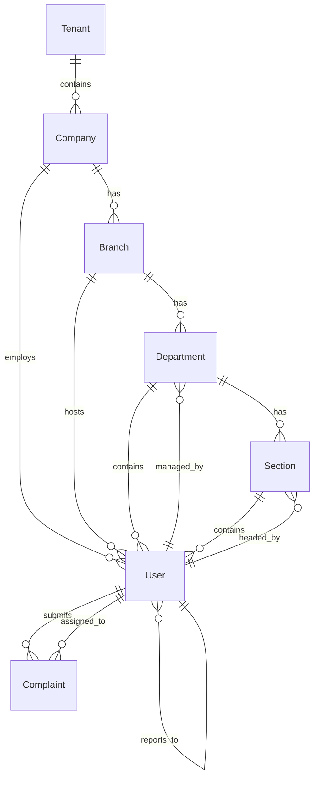

# Organizational Structure Design & Architecture
## Complaint Management System

---

## 1. Executive Summary

This document outlines the comprehensive design and architecture for implementing organizational structure management in the Complaint Management System. The organizational hierarchy enables proper complaint routing, escalation, permissions management, and reporting across the entire organization.

### Key Benefits
- **Automated Escalation**: Route complaints based on organizational hierarchy
- **Granular Permissions**: Control access based on organizational units
- **Better Reporting**: Generate reports by branch, department, section
- **Scalability**: Support multi-branch, multi-department enterprises
- **Compliance**: Track complaints at different organizational levels
- **Resource Management**: Assign users and roles based on structure

---

## 2. Organizational Hierarchy

### 2.1 Hierarchy Levels

```
Tenant (Root)
  └── Company
      └── Branch (Location/Office)
          └── Department (Business Unit)
              └── Section (Team/Group)
                  └── User/Employee
```

### 2.2 Hierarchy Characteristics

| Level | Description | Manager | Example |
|-------|-------------|---------|---------|
| **Tenant** | Top-level entity for multi-tenancy | System Admin | "Acme Corporation Group" |
| **Company** | Legal entity within tenant | Company Admin | "Acme Inc.", "Acme DMCC" |
| **Branch** | Physical location/office | Branch Manager | "Dubai Office", "London Office" |
| **Department** | Business unit/division | Department Head | "IT", "HR", "Finance" |
| **Section** | Team/group within department | Section Head | "Development Team", "Support Team" |
| **User** | Individual employee | Direct Manager | "John Doe", "Jane Smith" |

---

## 3. Database Schema

### 3.1 Current Entity Structure

#### Company Entity
```csharp
public class Company : BaseEntity
{
    public Guid TenantId { get; set; }
    public string Name { get; set; }
    public string Code { get; set; }
    public string? Description { get; set; }
    public string? ContactEmail { get; set; }
    public string? ContactPhone { get; set; }
    public string? Address { get; set; }
    public bool IsActive { get; set; }
    public string? OryggiCompanyId { get; set; }
    public string? LogoUrl { get; set; }

    // Navigation
    public Tenant Tenant { get; set; }
    public ICollection<Branch> Branches { get; set; }
    public ICollection<User> Users { get; set; }
}
```

#### Branch Entity
```csharp
public class Branch : BaseEntity
{
    public Guid CompanyId { get; set; }
    public string Name { get; set; }
    public string Code { get; set; }
    public string? Description { get; set; }
    public string? ContactEmail { get; set; }
    public string? ContactPhone { get; set; }
    public string? Address { get; set; }
    public string? City { get; set; }
    public string? Country { get; set; }
    public bool IsActive { get; set; }
    public string? OryggiBranchId { get; set; }

    // Navigation
    public Company Company { get; set; }
    public ICollection<Department> Departments { get; set; }
    public ICollection<User> Users { get; set; }
}
```

#### Department Entity
```csharp
public class Department : BaseEntity
{
    public Guid BranchId { get; set; }
    public string Name { get; set; }
    public string Code { get; set; }
    public string? Description { get; set; }
    public Guid? ManagerId { get; set; }  // Department Head
    public bool IsActive { get; set; }
    public string? OryggiDepartmentId { get; set; }

    // Navigation
    public Branch Branch { get; set; }
    public User? Manager { get; set; }
    public ICollection<Section> Sections { get; set; }
    public ICollection<User> Users { get; set; }
}
```

#### Section Entity
```csharp
public class Section : BaseEntity
{
    public Guid DepartmentId { get; set; }
    public string Name { get; set; }
    public string Code { get; set; }
    public string? Description { get; set; }
    public Guid? HeadId { get; set; }  // Section Head
    public bool IsActive { get; set; }
    public string? OryggiSectionId { get; set; }

    // Navigation
    public Department Department { get; set; }
    public User? Head { get; set; }
    public ICollection<User> Users { get; set; }
}
```

#### User Entity (Enhanced)
```csharp
public class User : BaseEntity
{
    // Organizational Mappings
    public Guid CompanyId { get; set; }
    public Guid? BranchId { get; set; }
    public Guid? DepartmentId { get; set; }
    public Guid? SectionId { get; set; }

    // User Information
    public string EmployeeCode { get; set; }
    public string FirstName { get; set; }
    public string LastName { get; set; }
    public string Email { get; set; }
    public string? Phone { get; set; }
    public string? JobTitle { get; set; }

    // Hierarchy
    public Guid? ManagerId { get; set; }
    public bool IsActive { get; set; }

    // Navigation
    public Company Company { get; set; }
    public Branch? Branch { get; set; }
    public Department? Department { get; set; }
    public Section? Section { get; set; }
    public User? Manager { get; set; }
    public ICollection<User> Subordinates { get; set; }
}
```

### 3.2 Database Relationships



---

## 4. Integration Points

### 4.1 Complaint Management Integration

#### Complaint Entity Enhancement
```csharp
public class Complaint : BaseEntity
{
    // Existing fields...

    // Organizational Context
    public Guid CompanyId { get; set; }
    public Guid? BranchId { get; set; }
    public Guid? DepartmentId { get; set; }
    public Guid? SectionId { get; set; }

    // Derived from Submitter if not explicitly set
    public Company Company { get; set; }
    public Branch? Branch { get; set; }
    public Department? Department { get; set; }
    public Section? Section { get; set; }
}
```

### 4.2 Escalation Policy Integration

#### Enhanced Escalation Policy
```csharp
public class EscalationPolicy : BaseEntity
{
    public Guid CompanyId { get; set; }
    public Guid? BranchId { get; set; }
    public Guid? DepartmentId { get; set; }
    public Guid? SectionId { get; set; }
    public Guid? CategoryId { get; set; }

    // Specificity Score (higher = more specific)
    // Category (5) > Section (4) > Department (3) > Branch (2) > Company (1)
    public int SpecificityScore { get; set; }

    // Policy Resolution: Most specific policy wins
    // Example: IT Dept + Bug Category > IT Dept > Company-wide
}
```

### 4.3 Role-Based Access Control Integration

#### Permission Scope
```csharp
public enum PermissionScope
{
    Company,        // Can access all branches
    Branch,         // Can access specific branch
    Department,     // Can access specific department
    Section,        // Can access specific section
    OwnOnly        // Can access only own complaints
}

public class UserRole
{
    public Guid UserId { get; set; }
    public Guid RoleId { get; set; }

    // Scope limitation
    public PermissionScope Scope { get; set; }
    public Guid? BranchId { get; set; }
    public Guid? DepartmentId { get; set; }
    public Guid? SectionId { get; set; }
}
```

---

## 5. Use Cases & Scenarios

### 5.1 Complaint Routing

**Scenario**: Employee submits complaint about their workstation

```
1. User: John Doe (Dubai Office > IT Dept > Development Section)
2. Complaint: "Laptop not working"
3. Auto-assign: IT Support Section Head (based on section)
4. Escalation Path:
   - Level 1: Section Head (Development)
   - Level 2: Department Head (IT)
   - Level 3: Branch Manager (Dubai Office)
   - Level 4: Company Admin
```

### 5.2 Permission Control

**Scenario**: Branch Manager views complaints

```
Role: Branch Manager (Dubai Office)
Access:
  - ✓ All complaints from Dubai Office
  - ✓ All departments under Dubai Office
  - ✓ All sections under Dubai Office departments
  - ✗ Complaints from London Office
  - ✗ Company-wide settings (unless System Admin)
```

### 5.3 Escalation Policy Resolution

**Scenario**: Resolve applicable escalation policy

```
Complaint Context:
  - Branch: Dubai Office
  - Department: IT
  - Section: Development
  - Category: Bug Report

Available Policies (ordered by specificity):
  1. SpecificityScore: 5 → IT Dept + Bug Category ✓ SELECTED
  2. SpecificityScore: 4 → Development Section
  3. SpecificityScore: 3 → IT Department
  4. SpecificityScore: 2 → Dubai Branch
  5. SpecificityScore: 1 → Company-wide

Result: Use policy #1 (most specific)
```

### 5.4 Reporting & Analytics

**Scenario**: Generate department-wise report

```sql
SELECT
    d.Name as Department,
    COUNT(c.Id) as TotalComplaints,
    AVG(DATEDIFF(hour, c.SubmittedAt, c.ResolvedAt)) as AvgResolutionHours,
    SUM(CASE WHEN c.Status = 'Open' THEN 1 ELSE 0 END) as OpenComplaints
FROM Complaints c
INNER JOIN Users u ON c.SubmittedById = u.Id
INNER JOIN Departments d ON u.DepartmentId = d.Id
WHERE c.CompanyId = @companyId
  AND c.SubmittedAt >= @startDate
GROUP BY d.Name
ORDER BY TotalComplaints DESC
```

---

## 6. API Design

### 6.1 Branch Management API

```http
### Get all branches for a company
GET /api/branches?companyId={companyId}&activeOnly={true}

### Get branch by ID
GET /api/branches/{id}

### Create branch
POST /api/branches
Content-Type: application/json
{
  "companyId": "guid",
  "name": "Dubai Office",
  "code": "DXB",
  "description": "Main office in Dubai",
  "contactEmail": "dubai@company.com",
  "contactPhone": "+971-xxx-xxxx",
  "address": "Sheikh Zayed Road, Dubai",
  "city": "Dubai",
  "country": "UAE",
  "isActive": true
}

### Update branch
PUT /api/branches/{id}

### Delete branch
DELETE /api/branches/{id}

### Get branch hierarchy (with departments and sections)
GET /api/branches/{id}/hierarchy
```

### 6.2 Department Management API

```http
### Get all departments for a branch
GET /api/departments?branchId={branchId}&activeOnly={true}

### Get department by ID
GET /api/departments/{id}

### Create department
POST /api/departments
Content-Type: application/json
{
  "branchId": "guid",
  "name": "IT Department",
  "code": "IT",
  "description": "Information Technology",
  "managerId": "guid",  // Department Head
  "isActive": true
}

### Update department
PUT /api/departments/{id}

### Delete department
DELETE /api/departments/{id}

### Get department with users
GET /api/departments/{id}/users
```

### 6.3 Section Management API

```http
### Get all sections for a department
GET /api/sections?departmentId={departmentId}&activeOnly={true}

### Get section by ID
GET /api/sections/{id}

### Create section
POST /api/sections
Content-Type: application/json
{
  "departmentId": "guid",
  "name": "Development Team",
  "code": "DEV",
  "description": "Software Development",
  "headId": "guid",  // Section Head
  "isActive": true
}

### Update section
PUT /api/sections/{id}

### Delete section
DELETE /api/sections/{id}

### Get section with users
GET /api/sections/{id}/users
```

### 6.4 Organizational Structure API

```http
### Get complete organizational tree
GET /api/organization/tree?companyId={companyId}
Response:
{
  "company": {
    "id": "guid",
    "name": "Acme Inc",
    "branches": [
      {
        "id": "guid",
        "name": "Dubai Office",
        "departments": [
          {
            "id": "guid",
            "name": "IT Department",
            "sections": [
              {
                "id": "guid",
                "name": "Development",
                "userCount": 15
              }
            ]
          }
        ]
      }
    ]
  }
}

### Get organizational path for user
GET /api/organization/user-path/{userId}
Response:
{
  "userId": "guid",
  "userName": "John Doe",
  "company": "Acme Inc",
  "branch": "Dubai Office",
  "department": "IT Department",
  "section": "Development Team",
  "manager": "Jane Smith",
  "reportingChain": [
    "Jane Smith (Section Head)",
    "Bob Johnson (Department Head)",
    "Alice Williams (Branch Manager)"
  ]
}
```

---

## 7. Frontend Design

### 7.1 Admin Pages Structure

```
Admin Dashboard
├── Company Settings (existing)
├── Organizational Structure (NEW)
│   ├── Branch Management
│   │   ├── List View (grid with search/filter)
│   │   ├── Create/Edit Form
│   │   └── Branch Details (with departments)
│   ├── Department Management
│   │   ├── List View (grouped by branch)
│   │   ├── Create/Edit Form
│   │   └── Department Details (with sections, users)
│   ├── Section Management
│   │   ├── List View (grouped by department)
│   │   ├── Create/Edit Form
│   │   └── Section Details (with users)
│   └── Organization Chart (Visual Hierarchy)
│       └── Interactive tree view
├── User Management (enhanced)
│   └── Add organizational unit selection
├── Escalation Policies (enhanced)
│   └── Add organizational unit filtering
└── Reports (enhanced)
    └── Add organizational unit breakdowns
```

### 7.2 Organization Chart Component

```typescript
interface OrganizationNode {
  id: string;
  type: 'company' | 'branch' | 'department' | 'section';
  name: string;
  code: string;
  manager?: {
    id: string;
    name: string;
    email: string;
  };
  children: OrganizationNode[];
  userCount: number;
  activeComplaintsCount: number;
}

// Interactive features:
// - Expand/collapse nodes
// - Click to view details
// - Search/filter
// - Export as PDF/image
```

### 7.3 User Form Enhancement

```html
<!-- User Creation/Edit Form -->
<form>
  <!-- Existing fields... -->

  <!-- Organizational Assignment -->
  <div class="org-assignment">
    <h3>Organizational Assignment</h3>

    <select [(ngModel)]="user.branchId" (change)="onBranchChange()">
      <option value="">Select Branch</option>
      <option *ngFor="let branch of branches" [value]="branch.id">
        {{branch.name}}
      </option>
    </select>

    <select [(ngModel)]="user.departmentId" (change)="onDepartmentChange()">
      <option value="">Select Department</option>
      <option *ngFor="let dept of filteredDepartments" [value]="dept.id">
        {{dept.name}}
      </option>
    </select>

    <select [(ngModel)]="user.sectionId">
      <option value="">Select Section (Optional)</option>
      <option *ngFor="let section of filteredSections" [value]="section.id">
        {{section.name}}
      </option>
    </select>

    <select [(ngModel)]="user.managerId">
      <option value="">Select Manager (Optional)</option>
      <option *ngFor="let manager of potentialManagers" [value]="manager.id">
        {{manager.fullName}} - {{manager.jobTitle}}
      </option>
    </select>
  </div>
</form>
```

---

## 8. Implementation Roadmap

### Phase 1: Backend Foundation (Week 1-2)
- [x] Database models (already exist)
- [ ] Create repositories for Branch, Department, Section
- [ ] Create services for organizational structure management
- [ ] Create API controllers and endpoints
- [ ] Add validation and business rules
- [ ] Write unit tests

### Phase 2: API Integration (Week 2-3)
- [ ] Integrate with existing User service
- [ ] Enhance Complaint service with org context
- [ ] Update Escalation policy resolution logic
- [ ] Update permission checking logic
- [ ] Add organizational filtering to queries

### Phase 3: Frontend Implementation (Week 3-4)
- [ ] Create Branch management component
- [ ] Create Department management component
- [ ] Create Section management component
- [ ] Create Organization chart component
- [ ] Update User management form
- [ ] Update Escalation policy form

### Phase 4: Advanced Features (Week 4-5)
- [ ] Implement organizational reporting
- [ ] Add bulk user assignment
- [ ] Create org structure import/export
- [ ] Add organizational analytics dashboard
- [ ] Implement audit logging for org changes

### Phase 5: Testing & Deployment (Week 5-6)
- [ ] Integration testing
- [ ] User acceptance testing
- [ ] Performance optimization
- [ ] Documentation
- [ ] Deployment to production

---

## 9. Data Migration Strategy

### 9.1 Existing Data Handling

```sql
-- Step 1: Create default organizational structure
INSERT INTO Branches (Id, CompanyId, Name, Code, IsActive)
VALUES (NEWID(), @CompanyId, 'Main Office', 'MAIN', 1);

INSERT INTO Departments (Id, BranchId, Name, Code, IsActive)
VALUES (NEWID(), @BranchId, 'General', 'GEN', 1);

-- Step 2: Assign existing users to default structure
UPDATE Users
SET BranchId = @DefaultBranchId,
    DepartmentId = @DefaultDepartmentId
WHERE CompanyId = @CompanyId
  AND BranchId IS NULL;

-- Step 3: Update existing complaints
UPDATE Complaints
SET BranchId = u.BranchId,
    DepartmentId = u.DepartmentId,
    SectionId = u.SectionId
FROM Complaints c
INNER JOIN Users u ON c.SubmittedById = u.Id
WHERE c.BranchId IS NULL;
```

### 9.2 Oryggi Sync Enhancement

```csharp
public class OryggiSyncService
{
    // Sync order: Company → Branch → Department → Section → Employee

    public async Task SyncOrganizationalStructure()
    {
        // 1. Sync companies
        var companies = await _oryggiClient.GetCompaniesAsync();
        await SyncCompanies(companies);

        // 2. Sync branches
        var branches = await _oryggiClient.GetBranchesAsync();
        await SyncBranches(branches);

        // 3. Sync departments
        var departments = await _oryggiClient.GetDepartmentsAsync();
        await SyncDepartments(departments);

        // 4. Sync sections
        var sections = await _oryggiClient.GetSectionsAsync();
        await SyncSections(sections);

        // 5. Sync employees with org assignments
        var employees = await _oryggiClient.GetEmployeesAsync();
        await SyncEmployees(employees);
    }
}
```

---

## 10. Performance Considerations

### 10.1 Caching Strategy

```csharp
public class OrganizationCacheService
{
    private readonly IMemoryCache _cache;
    private const string CACHE_KEY_PREFIX = "org_";
    private static readonly TimeSpan CACHE_DURATION = TimeSpan.FromHours(1);

    // Cache organizational tree (rarely changes)
    public async Task<OrganizationTree> GetOrganizationTreeAsync(Guid companyId)
    {
        var cacheKey = $"{CACHE_KEY_PREFIX}tree_{companyId}";

        if (_cache.TryGetValue(cacheKey, out OrganizationTree? tree))
            return tree!;

        tree = await _repository.GetOrganizationTreeAsync(companyId);
        _cache.Set(cacheKey, tree, CACHE_DURATION);

        return tree;
    }

    // Invalidate cache on organizational changes
    public void InvalidateCache(Guid companyId)
    {
        _cache.Remove($"{CACHE_KEY_PREFIX}tree_{companyId}");
    }
}
```

### 10.2 Query Optimization

```csharp
// Use eager loading for organizational context
public async Task<List<Complaint>> GetComplaintsAsync(Guid companyId)
{
    return await _context.Complaints
        .Include(c => c.Company)
        .Include(c => c.Branch)
        .Include(c => c.Department)
        .Include(c => c.Section)
        .Include(c => c.SubmittedBy)
            .ThenInclude(u => u.Manager)
        .Where(c => c.CompanyId == companyId)
        .OrderByDescending(c => c.CreatedAt)
        .ToListAsync();
}

// Create indexes for common queries
CREATE INDEX IX_Users_OrganizationalUnits
ON Users(CompanyId, BranchId, DepartmentId, SectionId);

CREATE INDEX IX_Complaints_OrganizationalUnits
ON Complaints(CompanyId, BranchId, DepartmentId, SectionId);
```

---

## 11. Security Considerations

### 11.1 Access Control Rules

```csharp
public class OrganizationalAccessControl
{
    // Check if user can access complaints from specific org unit
    public bool CanAccessOrganizationalUnit(User user, Guid? branchId, Guid? deptId, Guid? sectionId)
    {
        // System Admin: Access everything
        if (user.HasRole("SystemAdmin"))
            return true;

        // Company Admin: Access entire company
        if (user.HasRole("CompanyAdmin"))
            return true;

        // Branch Manager: Access specific branch
        if (user.HasRole("BranchManager") && user.BranchId == branchId)
            return true;

        // Department Head: Access specific department
        if (user.HasRole("DepartmentHead") && user.DepartmentId == deptId)
            return true;

        // Section Head: Access specific section
        if (user.HasRole("SectionHead") && user.SectionId == sectionId)
            return true;

        // Employee: Access only own complaints
        return false;
    }
}
```

### 11.2 Data Isolation

```csharp
// Apply organizational filters automatically
public class OrganizationalQueryFilter : IQueryFilter
{
    public IQueryable<T> ApplyFilter<T>(IQueryable<T> query, User currentUser)
        where T : IOrganizationalEntity
    {
        if (currentUser.HasRole("SystemAdmin", "CompanyAdmin"))
            return query;

        if (currentUser.HasRole("BranchManager"))
            return query.Where(e => e.BranchId == currentUser.BranchId);

        if (currentUser.HasRole("DepartmentHead"))
            return query.Where(e => e.DepartmentId == currentUser.DepartmentId);

        if (currentUser.HasRole("SectionHead"))
            return query.Where(e => e.SectionId == currentUser.SectionId);

        return query.Where(e => e.SubmittedById == currentUser.Id);
    }
}
```

---

## 12. Benefits Realization

### 12.1 Before Implementation

- ❌ No structured organization hierarchy
- ❌ Manual complaint assignment
- ❌ Generic escalation rules
- ❌ Limited reporting capabilities
- ❌ No organizational context in permissions
- ❌ Difficult to scale across branches

### 12.2 After Implementation

- ✅ Complete organizational hierarchy (Company → Branch → Dept → Section)
- ✅ Automatic routing based on org structure
- ✅ Org-specific escalation policies
- ✅ Rich reporting by organizational unit
- ✅ Granular permissions by org level
- ✅ Easy to manage multi-branch operations
- ✅ Clear reporting chains and accountability
- ✅ Better resource allocation and workload distribution

---

## 13. Conclusion

The organizational structure implementation is fundamental for creating an enterprise-grade complaint management system. It provides the foundation for:

1. **Scalability**: Support organizations with multiple branches and departments
2. **Automation**: Auto-route and escalate complaints based on structure
3. **Control**: Implement fine-grained permissions and access control
4. **Visibility**: Generate meaningful reports and analytics
5. **Compliance**: Meet organizational reporting requirements
6. **Efficiency**: Streamline operations through proper structuring

The existing database models are already well-designed. The implementation will focus on creating the service layer, API endpoints, and frontend components to fully leverage this structure.

---

**Document Version**: 1.0
**Last Updated**: 2025-10-12
**Author**: System Architect
**Status**: Design Approved - Ready for Implementation
