# Workflow Management - Visual Diagrams

This document contains visual diagrams to help understand the workflow management system.

---

## Diagram 1: Complete System Architecture

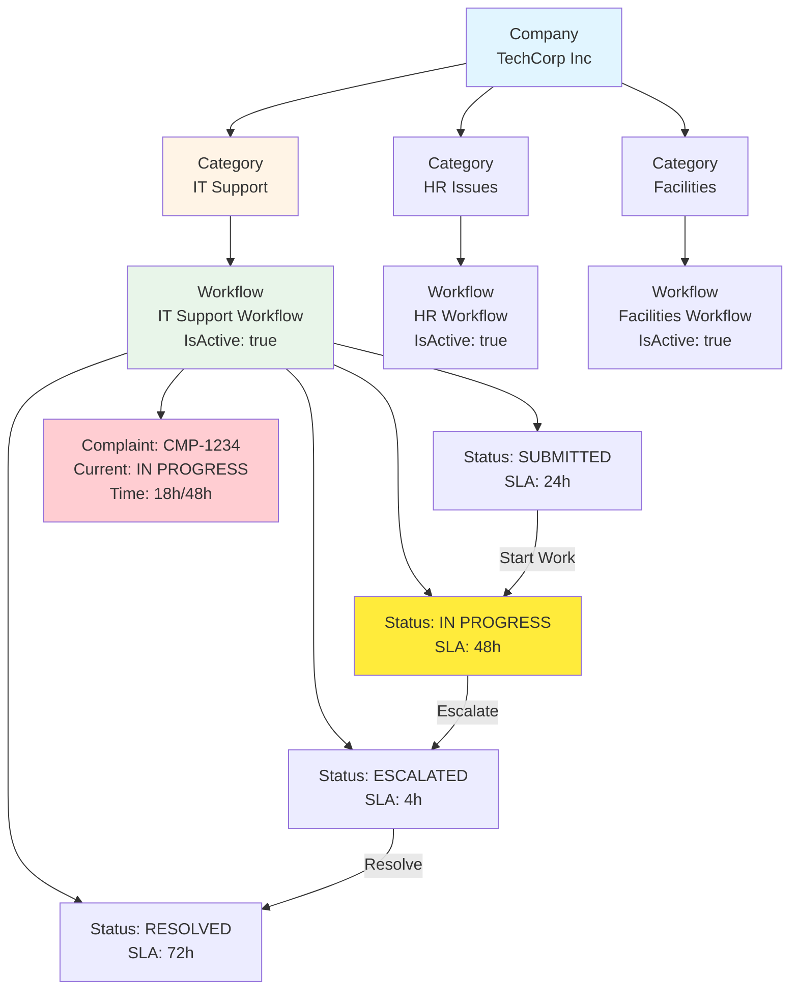

---

## Diagram 2: Category-Workflow Association

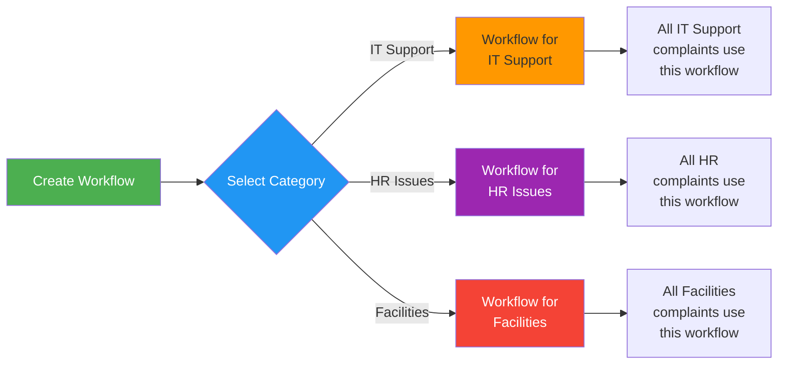

---

## Diagram 3: Workflow Status Lifecycle with SLA

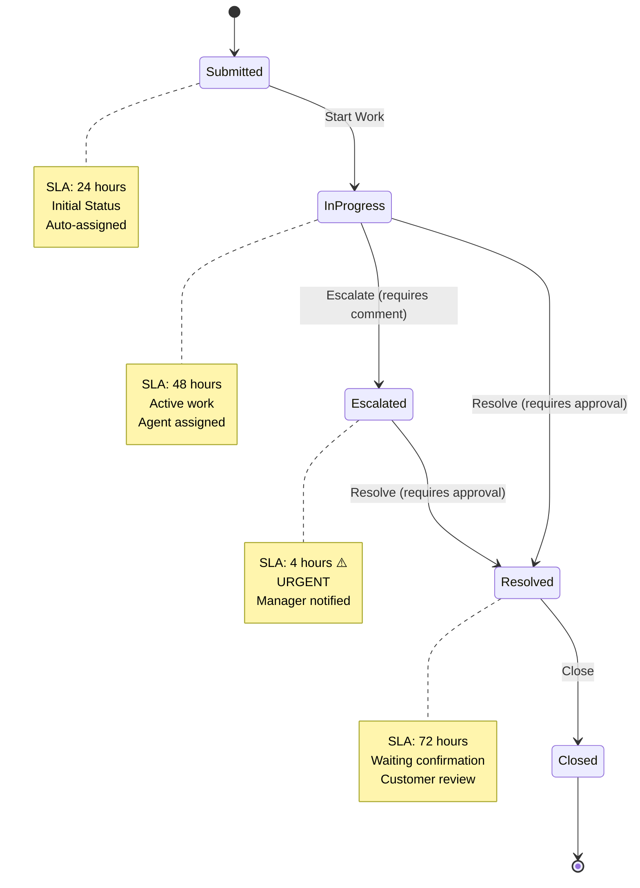

---

## Diagram 4: SLA Timeline Visualization

```mermaid
gantt
    title Complaint Lifecycle with SLA Tracking
    dateFormat HH:mm
    axisFormat %H:%M

    section Submitted Status
    SLA: 24h allowed    :active, s1, 00:00, 24h
    Actual: 2h spent    :crit, s2, 00:00, 2h

    section In Progress Status
    SLA: 48h allowed    :active, p1, 02:00, 48h
    Actual: 18h spent   :crit, p2, 02:00, 18h
    Time remaining      :p3, 20:00, 30h

    section Escalated Status
    SLA: 4h allowed     :active, e1, 50:00, 4h
    Expected completion :crit, e2, 50:00, 2h
```

---

## Diagram 5: Workflow Creation Process

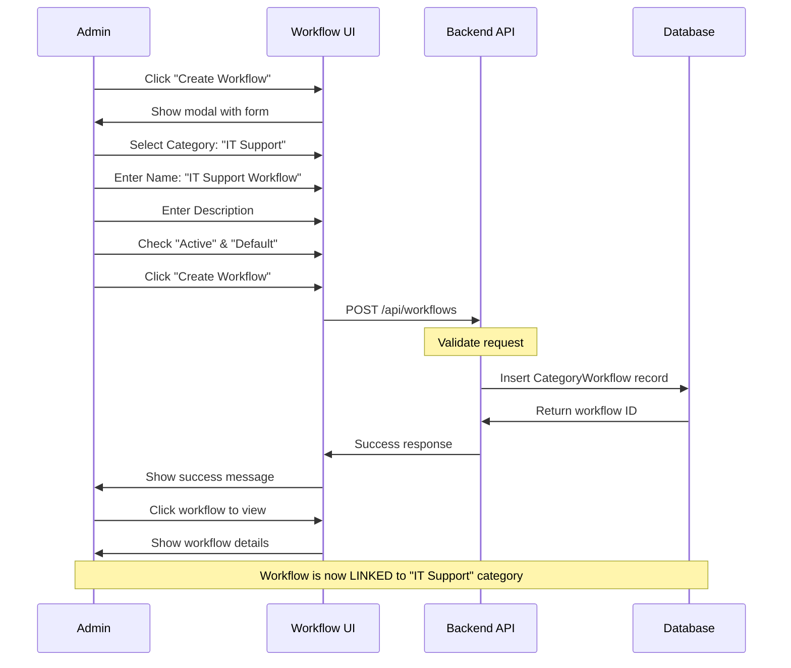

---

## Diagram 6: SLA Monitoring and Escalation

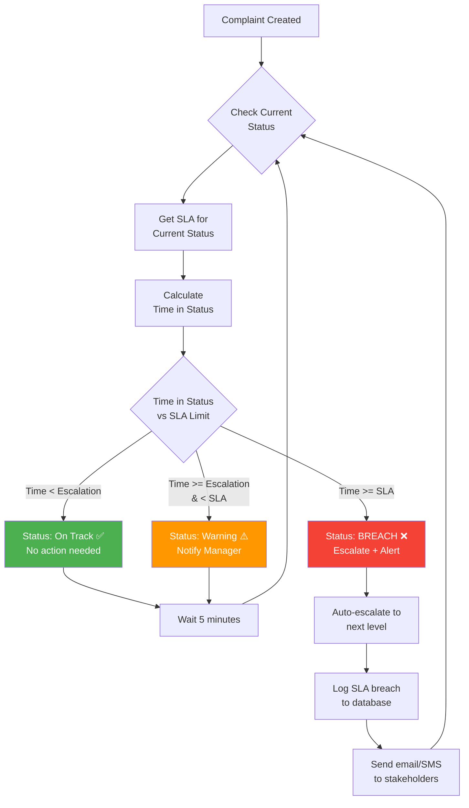

---

## Diagram 7: Add Status to Workflow Process

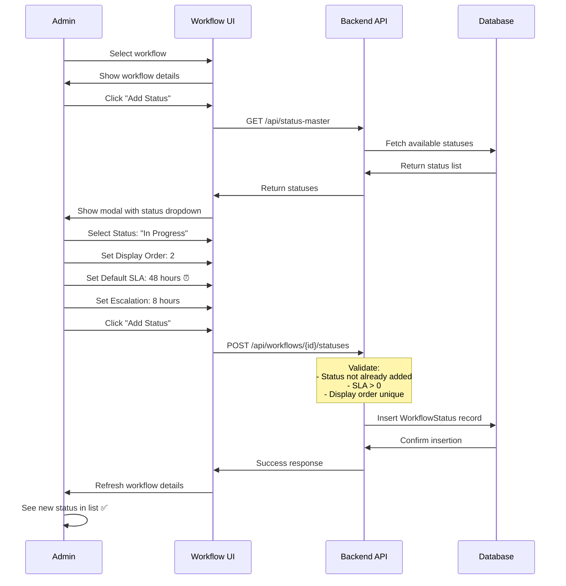

---

## Diagram 8: Add Transition to Workflow Process

```mermaid
flowchart LR
    A[Select Workflow] --> B[Click Add Transition]
    B --> C[Select FROM Status:<br/>Submitted]
    C --> D[Select TO Status:<br/>In Progress]
    D --> E[Enter Name:<br/>Start Work]
    E --> F{Requires<br/>Comment?}
    F -->|Yes| G[Check Requires Comment]
    F -->|No| H[Leave unchecked]
    G --> I{Requires<br/>Approval?}
    H --> I
    I -->|Yes| J[Check Requires Approval]
    I -->|No| K[Leave unchecked]
    J --> L[Select Allowed Roles]
    K --> L
    L --> M[Click Add Transition]
    M --> N[Transition Created ✅]

    style A fill:#2196F3,color:#fff
    style N fill:#4CAF50,color:#fff
    style F fill:#FF9800
    style I fill:#FF9800
```

---

## Diagram 9: Complaint Status Transition Flow

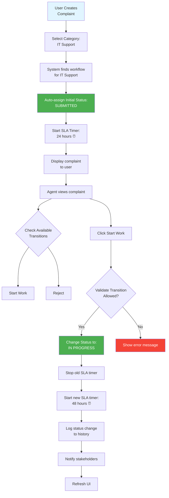

---

## Diagram 10: Why Workflow Deletion is Not Supported

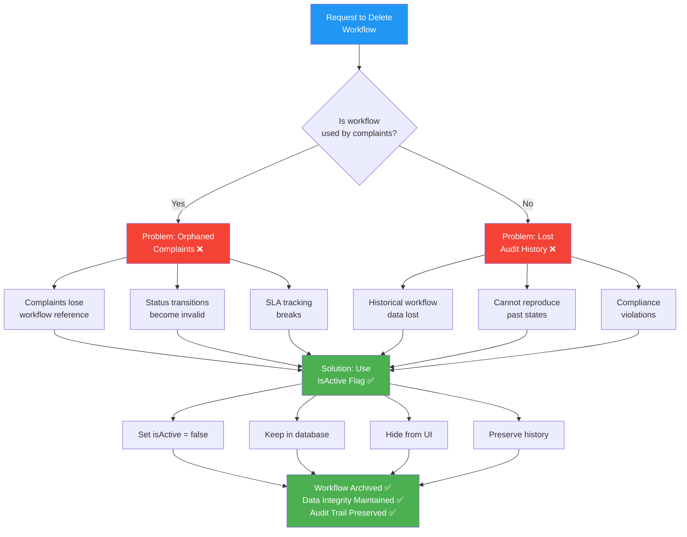

---

## Diagram 11: SLA Breach Scenarios

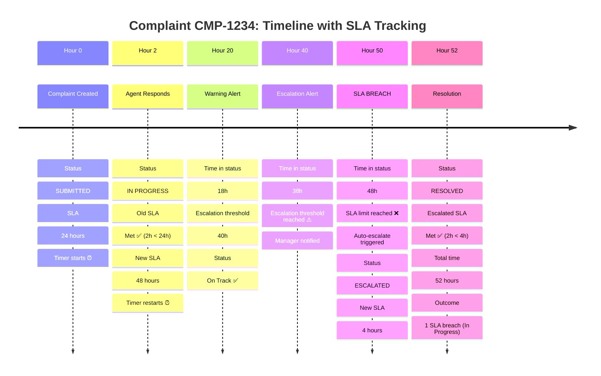

---

## Diagram 12: User Interface Workflow

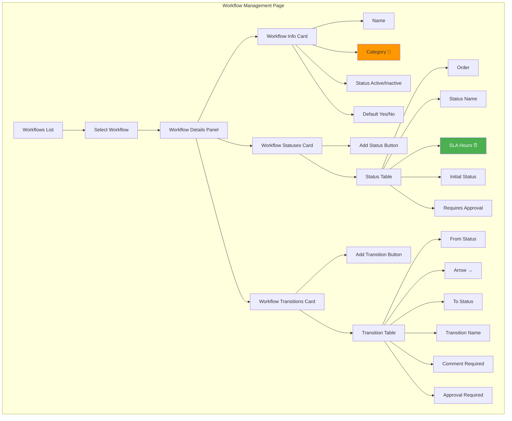

---

## Diagram 13: Real-World Example - IT Support Workflow

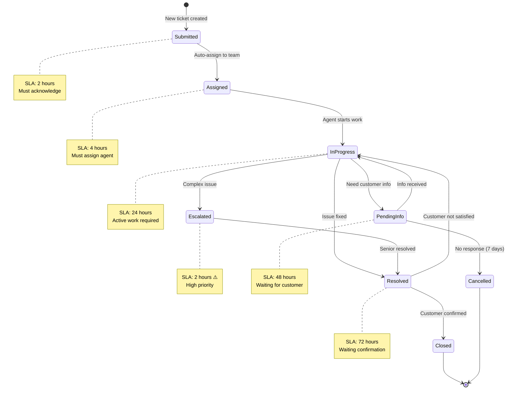

---

## Diagram 14: Database Schema Visualization

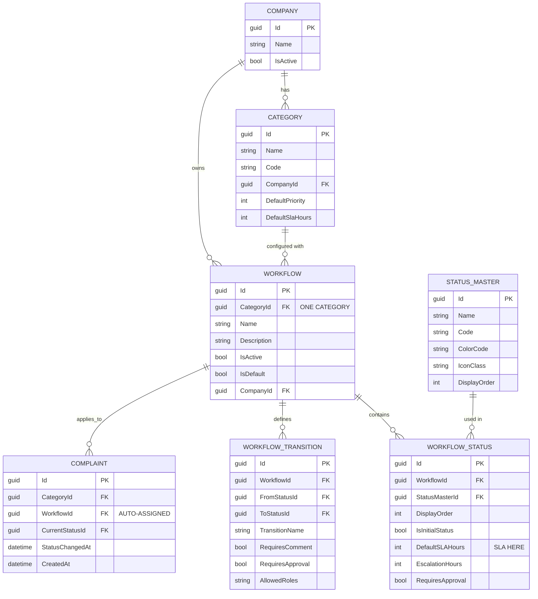

---

## Diagram 15: Complete Workflow Lifecycle

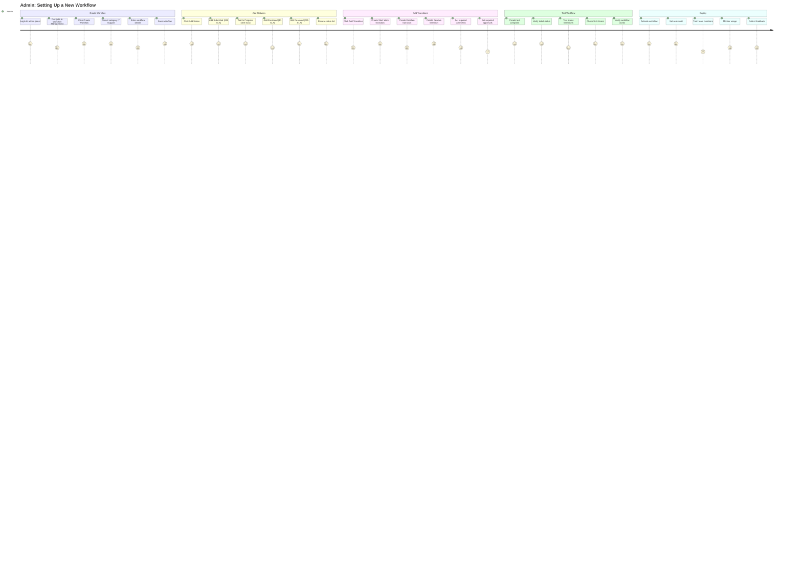

---

## How to Use These Diagrams

### Viewing Diagrams:
1. **GitHub/GitLab**: These Mermaid diagrams render automatically
2. **VS Code**: Install "Markdown Preview Mermaid Support" extension
3. **Online**: Use https://mermaid.live to view and edit
4. **Export**: Convert to PNG/SVG for presentations

### Diagram Legend:

- **Blue boxes**: Entry points or actions
- **Green boxes**: Success states or positive outcomes
- **Orange boxes**: Warning states or decisions
- **Red boxes**: Error states or problems
- **Yellow boxes**: Current/active states
- **Arrows**: Flow direction or relationships

### Quick Reference:

- **Diagram 1**: Overall system architecture
- **Diagram 2**: Category-workflow association (answers Question 2)
- **Diagram 3**: Status lifecycle with SLA (answers Question 3)
- **Diagram 4**: SLA timeline visualization
- **Diagram 5-8**: Process flows for creating workflows
- **Diagram 9**: Complaint transition flow
- **Diagram 10**: Why deletion is not supported (answers Question 1)
- **Diagram 11**: SLA breach scenarios
- **Diagram 12**: UI structure
- **Diagram 13**: Real-world example
- **Diagram 14**: Database schema
- **Diagram 15**: Complete admin journey

---

**Document Created:** November 3, 2025
**Diagrams:** 15 comprehensive visualizations
**Purpose:** Visual guide for workflow management concepts

---

*End of Workflow Visual Diagrams*
